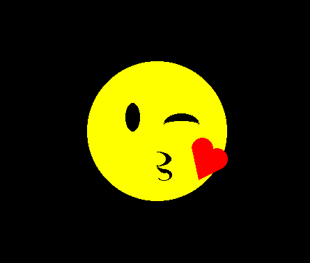
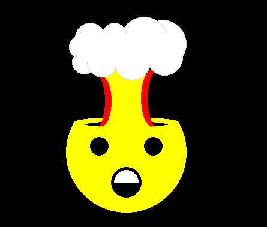
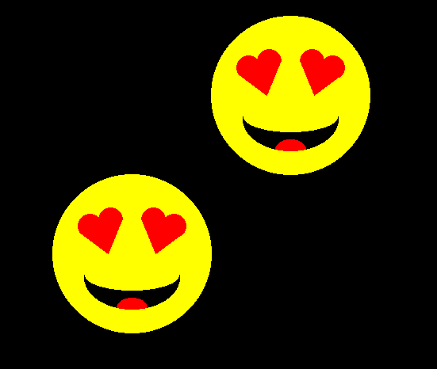
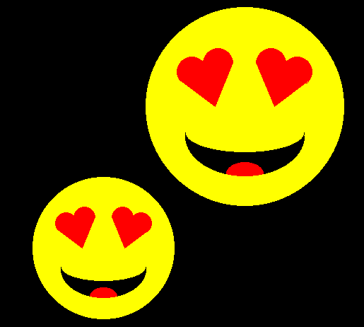

# Computer Graphics

We studied different line drawing algorithms and circle drawing algorithms and used them to draw emoticons. :mortar_board:

**Selected Emoticon**: :heart_eyes:

## Assignment 1
Learned about the following Line Drawing algorithms, their implementations and their problems - 
 - Digital Differential Analyzer Line Drawing Algorithm
 - Bresenhams Line Drawing Algorithm
 - Midpoint Line Drawing Algortihm

 ## Assignment 2
Learned about the following Circle Drawing algorithms, and finally implemented them to create the emoticon as a deliverable of the assignment.

Apart from the above selected emoticon, I created the following emoticons 

## Assignment 3

After creating the emoticon, we performed the following transformations - 

- Translation

  

- Rotation

  

- Scaling

  

